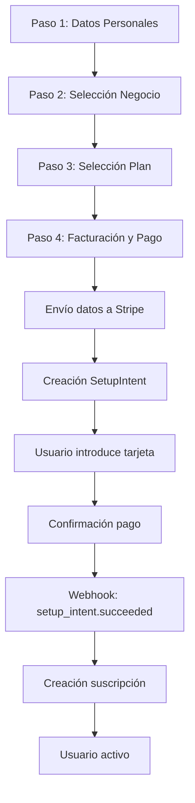

# Análisis del Flujo de Facturación y Suscripción

## Estado Actual ✅

### Flujo Correcto Implementado
1. **Paso 1**: Recopilación de datos personales
2. **Paso 2**: Selección del negocio (Google Places) - Autocompletado de dirección
3. **Paso 3**: Selección del plan
4. **Paso 4**: 
   - Formulario de facturación
   - Envío de datos a Stripe ANTES del pago ✅
   - Creación del SetupIntent con datos de facturación ✅
   - Confirmación del pago
   - Creación de la suscripción vía webhook

### Datos de Facturación - Origen

#### Autocompletados (desde Google Places):
- `billingAddress`: Extraído de address_components (street_number + route)
- `billingPostalCode`: Extraído de address_components (postal_code)
- `billingCity`: Extraído de address_components (locality)
- `billingProvince`: Extraído de address_components (administrative_area_level_2)
- `billingCountry`: Por defecto "España"

#### Entrada Manual (Paso 4):
- `customerType`: Autónomo o Empresa
- `legalName`: Razón social o nombre completo
- `companyNIF`: NIF/CIF con validación
- `billingEmail`: Email para facturas
- `billingPhone`: Teléfono de contacto

## Problemas Identificados 🔴

### 1. Código Redundante en StripePaymentForm
```javascript
// LÍNEAS 146-173 de StripePaymentForm.tsx
// Este código intenta enviar datos DESPUÉS del pago (incorrecto)
if (billingInfo) {
  const billingResponse = await fetch('/api/admin/billing', {
    // Este endpoint NO EXISTE
  });
}
```

### 2. Endpoint Inexistente
- `/api/admin/billing` no está implementado
- No es necesario porque los datos ya se envían en `preparePayment`

## Solución Propuesta 💡

### 1. Eliminar Código Redundante
Eliminar las líneas 146-173 de `StripePaymentForm.tsx` que intentan enviar datos de facturación después del pago.

### 2. Mejorar Validación
- Validar NIF/CIF en tiempo real ✅ (ya implementado)
- Validar que todos los campos obligatorios estén completos antes de procesar el pago

### 3. Estructura de Datos Correcta
Los datos ya se guardan correctamente en MongoDB:
```javascript
{
  billing: {
    customerType: "empresa|autonomo",
    legalName: "Nombre fiscal",
    taxId: "NIF/CIF",
    email: "email@facturacion.com",
    phone: "+34 XXX XXX XXX",
    address: {
      line1: "Dirección completa",
      line2: "Información adicional",
      city: "Ciudad",
      state: "Provincia",
      postal_code: "Código postal",
      country: "ES"
    },
    stripeCustomerId: "cus_xxx",
    stripeTaxId: "tax_xxx", // Tax ID en Stripe
    metadata: {
      businessId: "xxx",
      customerType: "empresa|autonomo",
      legalName: "Nombre fiscal"
    },
    createdAt: Date,
    updatedAt: Date
  }
}
```

## Integración con Stripe ✅

### Customer en Stripe
```javascript
{
  id: "cus_xxx",
  email: "email@cliente.com",
  name: "Nombre fiscal",
  phone: "+34 XXX XXX XXX",
  address: {
    line1: "Dirección",
    city: "Ciudad",
    postal_code: "CP",
    country: "ES"
  },
  tax_ids: [{
    type: "es_cif",
    value: "B12345678"
  }],
  metadata: {
    businessId: "xxx",
    customerType: "empresa",
    legalName: "Razón Social"
  }
}
```

## Flujo Óptimo



## Checklist de Verificación

- [x] Datos de facturación se envían ANTES del pago
- [x] Customer en Stripe tiene todos los datos
- [x] Tax ID (es_cif) configurado para facturas españolas
- [x] Datos guardados en MongoDB
- [x] Validación de NIF/CIF
- [ ] Eliminar código redundante en StripePaymentForm
- [ ] Implementar webhook para actualizar facturación si cambia
- [ ] Añadir soporte para IGIC (7% Canarias)

## Notas Importantes

1. **API de Stripe**: Usando versión `2025-07-30.basil`
2. **Tax ID**: Tipo `es_cif` para España (válido para NIF y CIF)
3. **Autocompletado**: Funciona correctamente con Google Places
4. **Orden correcto**: Billing → SetupIntent → Payment → Subscription
