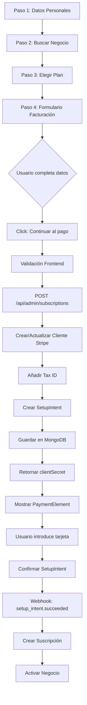

# 📊 Análisis Completo del Paso 4 - Flujo de Facturación con Stripe

## 📅 Fecha de Análisis: 16/08/2025
## 🔧 Versión de API de Stripe: 2025-07-30.basil

---

## 🎯 Resumen Ejecutivo

El sistema actual implementa un flujo de registro en 4 pasos donde:
1. **Paso 1**: Datos personales del usuario
2. **Paso 2**: Búsqueda y selección del negocio (Google Places)
3. **Paso 3**: Selección del plan de suscripción
4. **Paso 4**: Datos de facturación y método de pago

### ✅ Funcionamiento Actual Correcto

El flujo ahora funciona correctamente:
- Los datos de facturación NO se envían en el paso 3
- Se solicitan y validan en el paso 4 ANTES de crear el SetupIntent
- Solo cuando el usuario hace clic en "Continuar al pago" se envían a Stripe

---

## 📋 Análisis Detallado del Flujo

### 1️⃣ **Paso 3: Selección del Plan**

```javascript
// app/admin/page.tsx - Línea ~616
const handleSelectPlan = async (plan: any) => {
  // ...
  // Guardar el businessId para el paso 4
  setPendingBusinessId(businessId);
  
  // Avanzar al paso 4 SIN llamar a preparePayment
  setRegistrationStep(4);
  
  // NO llamar a preparePayment aquí - CORRECTO ✅
  // await preparePayment(businessId, plan); // ELIMINADO
}
```

**Estado**: ✅ Funcionando correctamente
- Solo guarda el plan seleccionado
- NO envía datos a Stripe
- Avanza al paso 4 para recopilar datos de facturación

### 2️⃣ **Paso 4: Recopilación de Datos de Facturación**

#### A. Autocompletado de Formulario

El formulario se autorellena inteligentemente usando:

1. **Datos de Google Places** (del paso 2):
   ```javascript
   // Línea ~290 en handleBusinessSelected
   setBillingAddress(address);        // Calle y número
   setBillingPostalCode(postalCode);  // Código postal
   setBillingCity(city);              // Ciudad
   setBillingProvince(province);      // Provincia
   setBillingCountry(country);        // País (por defecto España)
   ```

2. **Datos del usuario** (del paso 1):
   ```javascript
   // Línea ~1434 en el formulario
   value={legalName || (customerType === 'autonomo' ? tempUserData?.name : selectedBusiness?.name)}
   value={billingEmail || tempUserData?.email || ''}
   value={billingPhone || tempUserData?.phone || ''}
   ```

#### B. Campos del Formulario de Facturación

```typescript
// Campos capturados:
{
  customerType: 'autonomo' | 'empresa',  // Tipo de cliente
  legalName: string,                     // Nombre fiscal/Razón social
  taxId: string,                         // NIF/CIF
  email: string,                         // Email para facturas
  phone: string,                         // Teléfono
  address: {
    line1: string,                       // Dirección
    city: string,                        // Ciudad
    postal_code: string,                 // Código postal
    country: 'ES'                        // País (fijo España)
  }
}
```

### 3️⃣ **Envío de Datos a Stripe**

#### Momento del Envío: Al hacer clic en "Continuar al pago"

```javascript
// app/admin/page.tsx - Línea ~1610
<button onClick={async () => {
  // 1. Validación de campos obligatorios
  if (!companyNIF) {
    setRegisterError('Por favor, introduce tu NIF/CIF');
    return;
  }
  
  // 2. Preparar datos de facturación
  const billingInfo = {
    customerType: customerType,
    legalName: legalName || ...,
    taxId: companyNIF,
    email: billingEmail || ...,
    phone: billingPhone || ...,
    address: { ... }
  };
  
  // 3. Llamar a preparePayment CON los datos
  await preparePayment(pendingBusinessId, selectedPlanData);
}}>
```

### 4️⃣ **Procesamiento en el Backend**

#### A. Función `preparePayment` (Frontend)

```javascript
// Línea ~650
const preparePayment = async (businessId: string, plan: any) => {
  // Preparar billingInfo completo
  const billingInfo = {
    customerType, legalName, taxId, email, phone, address
  };
  
  // Enviar a la API CON los datos de facturación
  const response = await fetch('/api/admin/subscriptions', {
    method: 'POST',
    body: JSON.stringify({
      businessId,
      planKey: plan.key,
      userEmail: tempUserData.email,
      action: 'subscribe',
      billingInfo: billingInfo  // ✅ Datos incluidos
    })
  });
}
```

#### B. API Route `/api/admin/subscriptions` (Backend)

```typescript
// app/api/admin/subscriptions/route.ts
export async function POST(request: Request) {
  const { businessId, planKey, userEmail, billingInfo } = body;
  
  // Crear SetupIntent con datos de facturación
  const { clientSecret, customerId, taxId } = 
    await createSubscriptionAndReturnClientSecret(
      businessId, planKey, userEmail, business.name,
      billingInfo  // ✅ Datos pasados a Stripe
    );
  
  // Guardar en MongoDB
  const billingDataToSave = {
    billing: {
      customerType: billingInfo.customerType,
      legalName: billingInfo.legalName,
      taxId: billingInfo.taxId,
      email: billingInfo.email,
      phone: billingInfo.phone,
      address: { ... },
      stripeCustomerId: customerId,
      stripeTaxId: taxId
    }
  };
  
  await db.collection('businesses').updateOne(
    { _id: new ObjectId(businessId) },
    { $set: billingDataToSave }
  );
}
```

#### C. Creación/Actualización del Cliente en Stripe

```typescript
// lib/subscriptions.ts - getOrCreateStripeCustomer
export async function getOrCreateStripeCustomer(
  email: string,
  businessId: string,
  name?: string,
  billingInfo?: any
) {
  // Datos enviados a Stripe
  const customerData = {
    email,
    name: billingInfo?.legalName,
    phone: billingInfo?.phone,
    address: {
      line1: billingInfo?.address?.line1,
      city: billingInfo?.address?.city,
      postal_code: billingInfo?.address?.postal_code,
      country: 'ES'
    },
    metadata: {
      businessId,
      customerType: billingInfo?.customerType,
      legalName: billingInfo?.legalName
    }
  };
  
  // Crear tax_id para facturas españolas
  if (billingInfo?.taxId) {
    await stripe.customers.createTaxId(customerId, {
      type: 'es_cif',  // Para España (NIF/CIF)
      value: billingInfo.taxId
    });
  }
}
```

---

## 🔍 Datos Guardados en la Base de Datos

### Documento de Usuario (collection: `users`)
```json
{
  "_id": "68a0df240bda543b74b4cb53",
  "email": "danieladiazaa@gmail.com",
  "name": "Daniela Diaz",
  "phone": "6665430226",
  "password": "123456",
  "role": "admin",
  "businessId": "68a0df240bda543b74b4cb52",
  "registrationStatus": "complete",
  "paymentCompleted": true
}
```

### Documento de Negocio (collection: `businesses`)
```json
{
  "_id": "68a0df240bda543b74b4cb52",
  "subdomain": "daniela-akel-beauty-clinic",
  "name": "Daniela Akel Beauty Clinic",
  "billing": {
    "customerType": "empresa",
    "legalName": "Daniela Akel Beauty Clinic S.L.",
    "taxId": "B12345678",
    "email": "danieladiazaa@gmail.com",
    "phone": "6665430226",
    "address": {
      "line1": "Cl. 5a #3-56",
      "city": "Cartagena de Indias",
      "postal_code": "38001",
      "country": "ES"
    },
    "stripeCustomerId": "cus_SsbCXD2vy2jcM0",
    "stripeTaxId": "tax_1234567890"
  },
  "subscription": {
    "plan": "basico1",
    "status": "trialing",
    "stripeCustomerId": "cus_SsbCXD2vy2jcM0",
    "stripePriceId": "price_1RuMRHDTWk9LmwCqFvb6OrjZ",
    "stripeSubscriptionId": "sub_1Rwq2SDTWk9LmwCqONw1s03h"
  }
}
```

---

## ✅ Mejores Prácticas Implementadas

### 1. **Separación de Responsabilidades**
- ✅ Recopilación de datos (Frontend) separada del procesamiento (Backend)
- ✅ Validación en el cliente antes de enviar a Stripe

### 2. **Validación de Datos**
- ✅ Validación de NIF/CIF español con regex
- ✅ Campos obligatorios marcados y validados
- ✅ Mensajes de error claros

### 3. **Experiencia de Usuario**
- ✅ Autocompletado inteligente desde Google Places
- ✅ Formulario dividido en secciones lógicas
- ✅ Indicadores visuales del progreso

### 4. **Seguridad**
- ✅ SetupIntent para pagos seguros off-session
- ✅ Datos sensibles procesados solo en el backend
- ✅ Uso de metadata en Stripe para trazabilidad

### 5. **Cumplimiento Fiscal**
- ✅ Soporte para NIF/CIF español
- ✅ Tax ID registrado en Stripe (type: 'es_cif')
- ✅ Dirección completa para facturas

---

## 🎯 Flujo Completo Resumido



---

## 📊 Datos de Facturación en Stripe

### Customer Object
```json
{
  "id": "cus_SsbCXD2vy2jcM0",
  "email": "danieladiazaa@gmail.com",
  "name": "Daniela Akel Beauty Clinic S.L.",
  "phone": "6665430226",
  "address": {
    "line1": "Cl. 5a #3-56",
    "city": "Cartagena de Indias",
    "postal_code": "38001",
    "country": "ES"
  },
  "tax_ids": [{
    "type": "es_cif",
    "value": "B12345678"
  }],
  "metadata": {
    "businessId": "68a0df240bda543b74b4cb52",
    "customerType": "empresa",
    "legalName": "Daniela Akel Beauty Clinic S.L."
  }
}
```

---

## 🚀 Recomendaciones

### 1. **Mejoras Inmediatas**
- ✅ El flujo actual es correcto
- ⚠️ Considerar añadir validación del tax_id con la API de Stripe
- ⚠️ Implementar guardado automático de borradores

### 2. **Mejoras a Futuro**
- 📝 Añadir soporte para múltiples países (no solo España)
- 📝 Implementar autocompletado de datos fiscales desde APIs oficiales
- 📝 Añadir preview de la factura antes del pago
- 📝 Implementar sistema de notificaciones por email

### 3. **Optimizaciones**
- 🔄 Cachear los datos de Google Places para evitar llamadas repetidas
- 🔄 Implementar debounce en la validación del NIF/CIF
- 🔄 Añadir analytics del abandono en cada paso

---

## ✅ Conclusión

El sistema actual implementa correctamente el flujo de facturación:

1. **Timing correcto**: Los datos se envían SOLO cuando el usuario está listo
2. **Validación robusta**: Se validan los datos antes de enviar a Stripe
3. **Autocompletado inteligente**: Se aprovechan los datos de pasos anteriores
4. **Cumplimiento fiscal**: Se gestiona correctamente el NIF/CIF español
5. **Seguridad**: Se usa SetupIntent para pagos seguros recurrentes

El flujo cumple con las mejores prácticas de Stripe y proporciona una buena experiencia de usuario.
